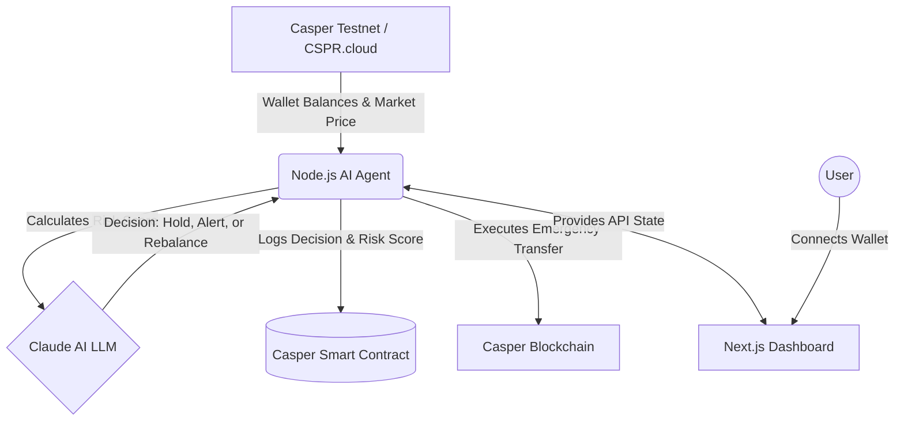

# 🛡️ DeFi Sentinel

DeFi Sentinel is an **Autonomous AI Guardian** for the Casper Network. It acts as your personal hedge-fund manager, monitoring your DeFi positions 24/7 and autonomously taking action to protect your assets during market crashes.

---

## 📉 The Problem
Crypto markets never sleep. They are 24/7, highly volatile, and entirely unforgiving. If you have funds locked up in DeFi (like heavily staked CSPR or collateralized loans) and the market suddenly crashes while you are asleep, **you can be liquidated and lose everything.** Managing DeFi risk currently requires humans to obsessively stare at charts and manually move funds, which is stressful and inefficient.

## 🛡️ The Solution
DeFi Sentinel solves this by assigning an AI Agent to watch your wallet. 
Instead of relying on a human, the Sentinel Agent runs continuously in the background, pinging the Casper blockchain and live market data every 60 seconds. It evaluates your real-time risk, and if things get dangerous, it **autonomously executes smart contract transactions** to save your position before a liquidation engine wipes you out.

---

## 🏗️ Architecture & Workflow

The project is split into two main components: the **Agent** (Backend) and the **Dashboard** (Frontend).



### 1. The Autonomous Agent (Node.js)
The brain of the operation. It runs as a continuous background process.
- **Data Ingestion:** Every 60 seconds, it fetches live wallet balances, delegation statuses, and CSPR/USD prices using the `CSPR.cloud` API.
- **Risk Engine:** Computes a deterministic risk score (0-100) based on factors like staking ratio (>80% is dangerous), liquid balances, and 24h market price drops.
- **AI Decisioning:** Feeds the risk data into an LLM (Claude). The AI acts as a financial analyst, deciding whether to `HOLD`, `ALERT`, or `REBALANCE`.
- **Execution & Smart Contracts:**
  - If the decision is `ALERT`, it writes the new elevated risk score to an on-chain Casper Smart Contract.
  - If the decision is `REBALANCE`, it uses the `casper-js-sdk` to cryptographically sign and broadcast an emergency transfer, moving your funds to safety.
- **State Management:** Tracks registered wallets using Prisma and SQLite.

### 2. The Dashboard (Next.js)
The control centre for the user.
- Built with React, Next.js, and Tailwind CSS.
- Users connect their Casper wallet address to register it with the Agent.
- Provides a real-time view of the Agent's thought process, displaying the current Risk Score, the specific Risk Factors, the AI's reasoning, and an immutable log of recent on-chain actions.

---

## 🚀 Key Features

- **24/7 Autonomous Monitoring:** No human intervention required. The agent loops indefinitely, monitoring the chain via CSPR.cloud.
- **AI-Driven Logic:** Moves beyond simple "if/then" trading bots. The AI understands context and provides plain-English reasoning for every action it takes.
- **On-Chain Auditability:** Every major change in risk is written to a Smart Contract, creating a transparent, immutable log of the AI's behavior.
- **Emergency Rebalancing:** Fully capable of signing and broadcasting `Transfer` deploys using the `casper-js-sdk` to protect user funds during black-swan events.

---

## 🛠️ Tech Stack

- **Casper Blockchain:** Smart Contracts, `casper-js-sdk`, Casper Testnet.
- **Data Layer:** CSPR.cloud REST API.
- **Backend Agent:** Node.js, Express, node-cron, Prisma, SQLite.
- **Frontend Dashboard:** Next.js (App Router), React, Tailwind CSS, Lucide Icons.
- **AI Integration:** OpenRouter (Claude / Anthropic).
- **Deployment:** Render (Agent API) & Vercel (Frontend Dashboard).

---

## 💻 Local Setup & Development

### Prerequisites
- Node.js 18+
- A CSPR.cloud API Key
- An Anthropic/OpenRouter API Key (Optional, falls back to deterministic logic if missing).

### 1. Setup the Agent
```bash
cd agent
npm install
cp .env.example .env
# Fill in your CSPR_CLOUD_API_KEY and AGENT_PRIVATE_KEY in .env

# Initialize the local SQLite database
npx prisma generate
npx prisma db push

# Start the agent
npm run dev
```

### 2. Setup the Dashboard
```bash
cd dashboard
npm install
cp .env.example .env.local
# Ensure NEXT_PUBLIC_AGENT_API_URL points to the running Agent (default: http://localhost:4000)

# Start the dashboard
npm run dev
```

Visit `http://localhost:3000` to connect your wallet and watch the Agent begin its analysis!

---

## 📜 License
MIT License. Built for the Casper Network ecosystem.
